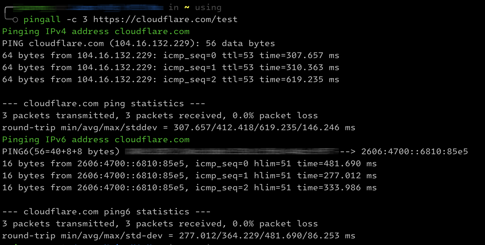

# PingAll Script Documentation

## Introduction

The `pingall` script is a versatile tool designed to enhance the efficiency and comprehensiveness of pinging hosts. It extends the functionality of traditional `ping` commands by supporting both IPv4 and IPv6 addresses and allows users to ping hosts specified by URLs, including those with HTTP/HTTPS protocols and paths.



## Features

- **Supports both IPv4 and IPv6**: Capable of pinging both IPv4 and IPv6 addresses.
- **URL Pinging**: Directly pings URLs with HTTP or HTTPS protocols, including URLs with paths (e.g., `https://example.com/abc/def`).
- **Automatic Address Type Recognition**: Discerns between IPv4 addresses, IPv6 addresses, and domain names.
- **Flexible Parameter Passing**: Passes additional ping parameters to both `ping` and `ping6` commands.

## Deployment

### Step 1: Downloading the Script

Download the `pingall.sh` script from this repository.

### Step 2: Setting Execution Permissions

Grant execution permissions to the script using the command:

```bash
chmod +x pingall.sh
```

### Step 3: Moving the Script to a System Path

Move the script to a system path (such as /usr/local/bin) to make it globally accessible:

```bash
mv pingall.sh /usr/local/bin/pingall
```

### Step 4: Verification

Verify the script's availability by executing:

```bash
pingall -h
```

## Usage

### Syntax

The script follows the standard ping command structure, with some extensions:

```bash
pingall [OPTIONS]... [HOST]...
```

### Options

- `-h`, `--help`: Display the help information.
- `-c` count: Set the number of ping attempts.

And, ALL standard ping and ping6 options are also SUPPORTED.

### Examples

- Pinging a single host: `pingall google.com`
- Pinging a URL with HTTP/HTTPS protocol: `pingall http://cloudflare.com/test`
- Specifying the ping count: `pingall -c 4 google.com`